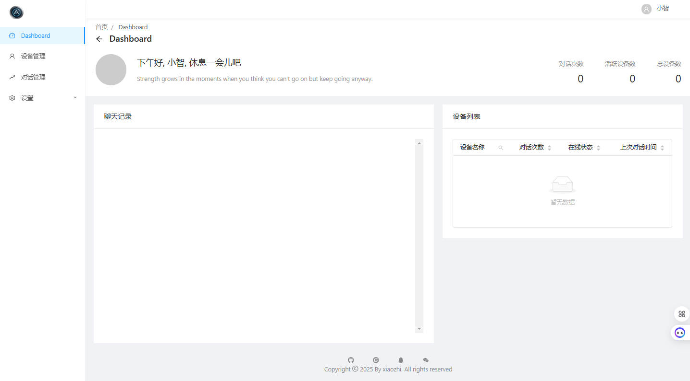
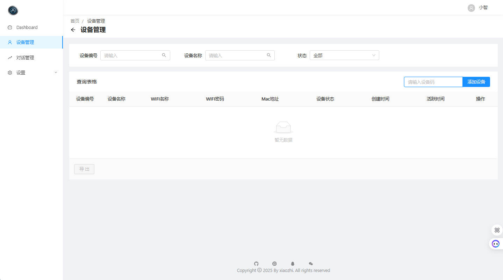
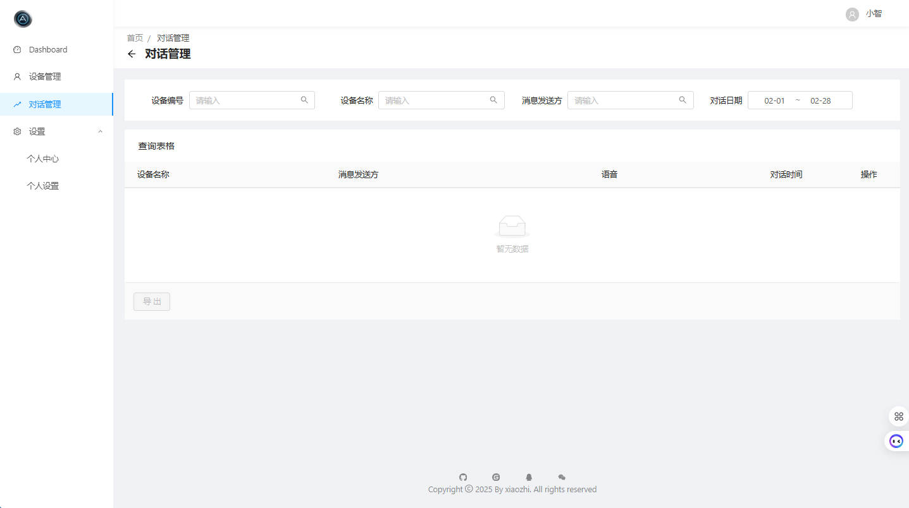

# Xiaozhi ESP32 WebUI

## 项目简介

Xiaozhi ESP32 WebUI 是基于 [Xiaozhi ESP32 Server](https://github.com/xinnan-tech/xiaozhi-esp32-server) 项目开发的前端管理平台。由于目前缺乏一个直观、高效的前端 Web 平台来管理设备和相关功能，因此本项目应运而生。

该 WebUI 旨在为用户提供一个功能丰富、操作便捷的管理界面，帮助用户更好地管理设备、配置等。

---

## 功能模块（设计中）

### 1. **设备管理**
   - 查看已接入的所有设备列表。
   - 设备状态实时监控（在线/离线、运行状态等）。
   - 添加、编辑、删除设备信息。

### 2. **音色选择**
   - 提供多种音色模板供用户选择。
   - 预览音色效果。
   - 为不同设备分配不同的音色配置。

### 3. **聊天记录**
   - 查看与设备的历史聊天记录。
   - 支持按日期、关键词搜索聊天内容。
   - 聊天数据可视化（如聊天频率统计图表）。

### 4. **唤醒词修改**
  - 查看与修改唤醒词。

### 5. **角色切换**
  - 预设角色切换（AI老师、男/女朋友、智能家居助手）
  - 混合模式

## UI样式

  
  
  

---

## 技术栈

- **前端框架**：Vue.js
- **样式库**：Ant Design
- **后端支持**：Java + 基于 Xiaozhi ESP32 Server 提供的 API
- **数据库**：MySQL（用于存储用户数据、聊天记录等）
  
---

## 开发计划

- **阶段 1**：实现基础功能（设备管理、音色选择、聊天记录查看）。
- **阶段 2**：完善用户管理、唤醒词修改、日志管理模块。
- **阶段 3**：增加数据可视化功能、增加流式对话记录。

---

## 贡献指南

欢迎任何形式的贡献！如果你有好的想法或发现问题，请联系反馈

---
