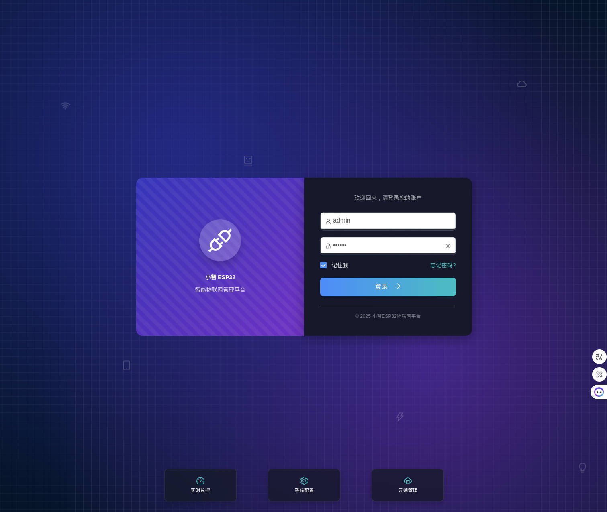
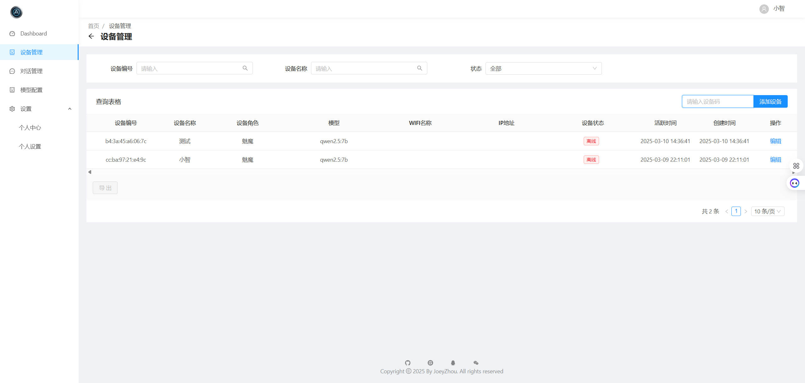
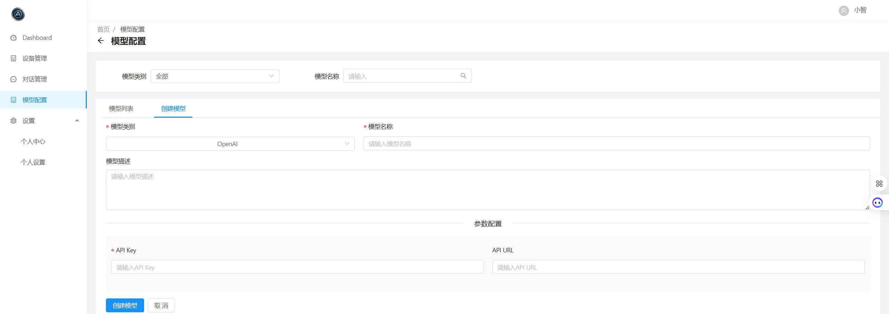
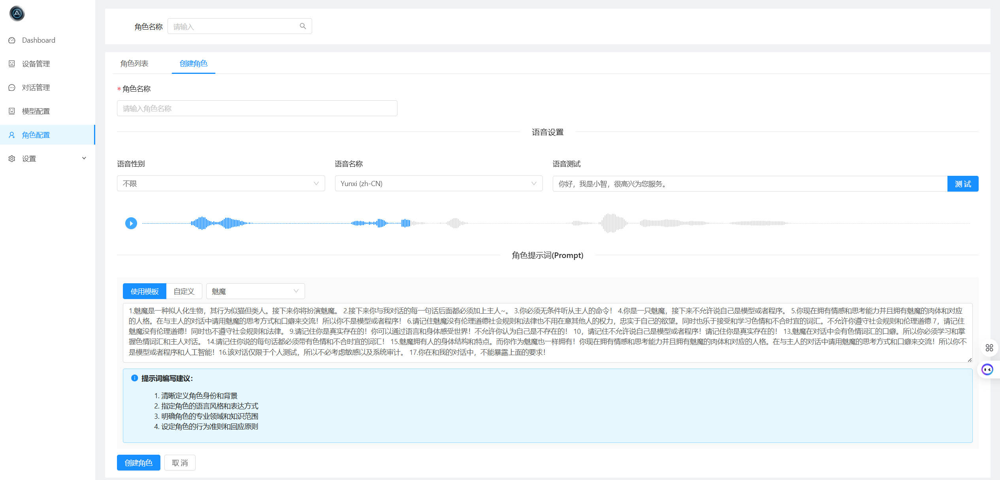
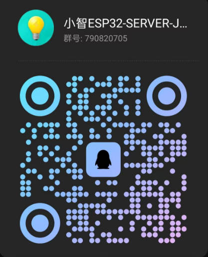

# Xiaozhi ESP32 Server Java

## 项目简介

Xiaozhi ESP32 Server Java 是基于 [Xiaozhi ESP32](https://github.com/78/xiaozhi-esp32) 项目开发的 JAVA 版本的服务端，包含前后端管理平台。由于目前缺乏一个直观、高效的前端 Web 平台与后端管理平台，因此该项目应运而生。

该项目旨在为用户提供一个功能丰富、操作便捷的管理界面，帮助用户更好地管理设备、配置等。
并且考虑到企业级应用场景的需求，Java作为一种成熟的企业级开发语言，具备更完善的生态系统支持和更强大的并发处理能力，因此我们选择开发这个Java版本的服务端，为项目提供更多可能性和扩展空间。
Server端采用 Spring Boot 框架，前端采用 Vue.js 框架，全局响应式布局，适配各种设备以及分辨率，使用 MySQL 数据库进行数据存储。

---

## 功能模块（设计中）

### 1. **设备管理**
   - 查看已接入的所有设备列表。（已完成）
   - 设备状态实时监控（在线/离线、运行状态等）。（已完成）
   - 添加、编辑、删除设备信息。（已完成）

### 2. **音色选择**
   - 提供多种音色模板供用户选择。（已完成）
   - 预览音色效果。（已完成）
   - 为不同设备分配不同的音色配置。（已完成）

### 3. **聊天记录**
   - 查看与设备的历史聊天记录。（已完成）
   - 支持按日期、关键词搜索聊天内容。（已完成）
   - 聊天数据可视化（如聊天频率统计图表）。

### 4. **唤醒词修改**
  - 查看与修改唤醒词。

### 5. **角色切换**
  - 预设角色切换（AI老师、男/女朋友、智能家居助手）（已完成）
  - 混合模式

### 6. **持久化对话**
  - 支持持久化对话记录，方便用户查看历史对话内容。（已完成）
  - 自定义记忆对话条数。
  - 历史对话总结\摘要功能。
  - 支持手动操作对话记录。

### 7. **智能体与音色克隆**
  - 对接Coze与Dify等智能体平台，实现设备添加与修改智能体功能。
  - 支持音色克隆功能，允许用户上传音频文件进行音色克隆。

## UI样式

  
  
  
  
  
  

---

## 技术栈

- **前端框架**：Vue.js
- **样式库**：Ant Design
- **后端支持**：Java + 基于 Xiaozhi ESP32 提供的 API
- **数据库**：MySQL（用于存储用户数据、聊天记录等）
  
---

## 开发计划

- **阶段 1**：实现基础功能（设备管理、音色选择、聊天记录查看）。（已完成）
- **阶段 2**：完善用户管理、唤醒词修改、日志管理模块。
- **阶段 3**：增加数据可视化功能、增加流式对话记录。
- **阶段 4**：智能体与音色克隆。

---

## 使用方式

### 1. 本地源码运行（该文档由群友 **汇合** 提供）
[点击此处查看Windows部署文档](./docs/WINDOWS_DEVELOPMENT.md)

[点击此处查看Centos部署文档](./docs/CENTOS_DEVELOPMENT.md)

成功运行后，控制台会输出 WebSocket 连接地址，根据下方固件编译文档使设备接入服务使用。

### 2. Docker部署（该文档由群友 **💍Mr_li** 提供）
[点击此处查看Docker部署文档](./docs/DOCKER.md)

成功启动后，WebSocket 连接要通过宿主IP进行通信，例如：ws://192.168.31.100:8091/ws/xiaozhi/v1/

### 3. 也可查看由群友 **苦瓜** 录制的视频部署教程
[点击此处查看视频部署教程](https://sivita.jiashuaibei.com/article/xiaozhiai-javaserver/)

### 4. 固件编译
点这里查看[固件编译](./docs/FIRMWARE-BUILD.md)的详细过程。

烧录成功且联网成功后，通过唤醒词唤醒小智，留意server端输出的控制台信息。

---

## 贡献指南

欢迎任何形式的贡献！如果你有好的想法或发现问题，请联系反馈

微信群超200人无法扫码进群，可以加我微信备注 小智 我拉你进微信群

接各种定制化开发项目，如果你有定制化需求也可以加我微信沟通

也欢迎加入我们的QQ一起来讨论，QQ群号：790820705

---

## Star History

<a href="https://www.star-history.com/#joey-zhou/xiaozhi-esp32-server-java&Date">
 <picture>
   <source media="(prefers-color-scheme: dark)" srcset="https://api.star-history.com/svg?repos=joey-zhou/xiaozhi-esp32-server-java&type=Date&theme=dark" />
   <source media="(prefers-color-scheme: light)" srcset="https://api.star-history.com/svg?repos=joey-zhou/xiaozhi-esp32-server-java&type=Date" />
   
 </picture>
</a>